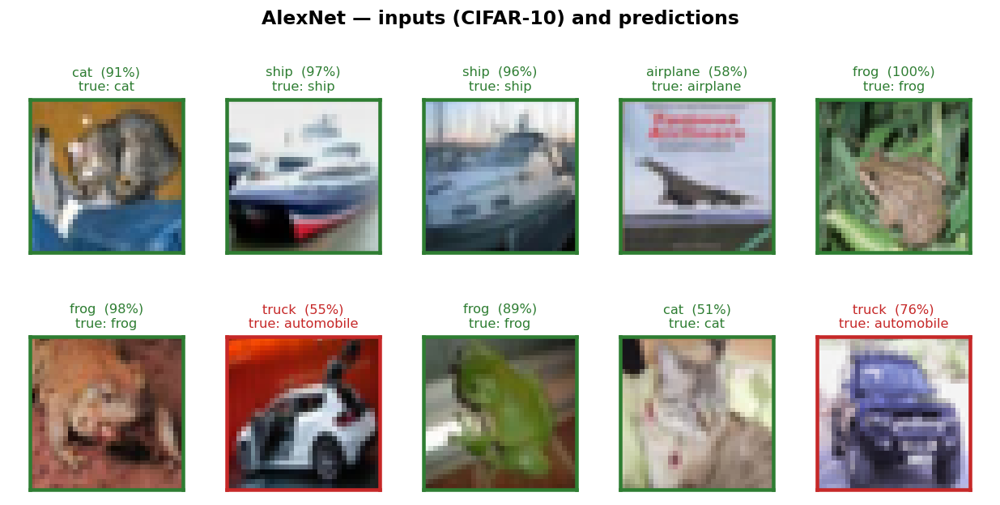
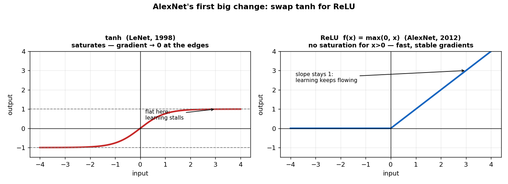
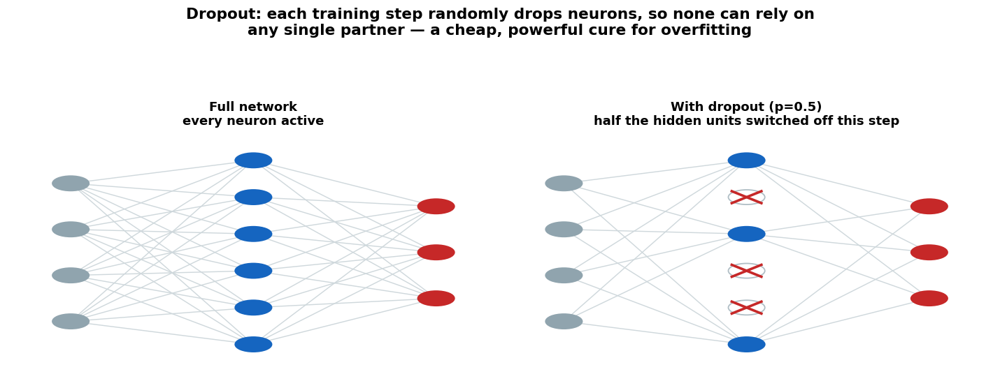
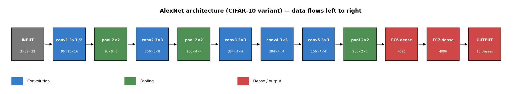
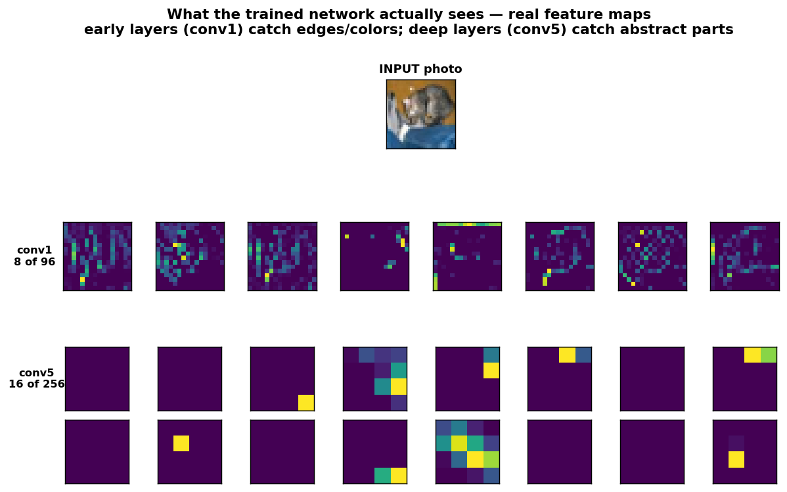
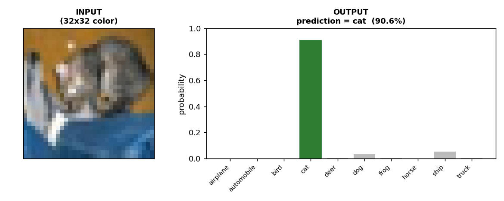

# Lesson 2 · AlexNet — Deep Learning Goes Mainstream

> **Stage 1 · Foundations** · Difficulty 🟢 Beginner · Dataset: CIFAR-10 · License: ✅ public (see `LICENSE-NOTES.md`)
>
> Part of [**paper2code2api**](../../../README.md) — learn computer vision by rebuilding the papers that built the field.

In [Lesson 1](../lenet5) you built LeNet-5 and read handwritten digits. That network was invented in 1998 — and then, for about fourteen years, not much happened. The ideas were right, but the world lacked two things: enough labelled data, and enough compute. In 2012 both arrived, and a network called **AlexNet** used the *same three ideas you already know* — convolution, pooling, learned features — scaled up and sharpened with a few new tricks, to win the ImageNet competition by a margin so large it ended the debate about whether deep learning worked. This is the network that started the modern AI boom.



This lesson builds AlexNet from scratch and trains it to classify **real color photos** — airplanes, cats, ships, trucks — instead of clean digits. By the end you'll have it running as an API you can throw your own pictures at.

### What you'll learn

- **Why LeNet didn't just scale up on its own** — the three things that had to change.
- **ReLU** — the tiny change to the activation function that made deep networks trainable, and *why* it works.
- **Dropout** — a brilliantly simple trick that stops a big network from memorising its training data.
- **Data augmentation** — making "more" data for free, exactly as the AlexNet authors did.
- **How AlexNet is wired** — five conv layers and three dense layers, and how it maps onto `model.py`.
- **Turning more paper equations into code** — ReLU, dropout, local response normalization, and the output-size formula *with stride this time*.
- **How to train it** on CIFAR-10 color photos and reach **~80%** test accuracy on a laptop CPU.
- **How to serve it** behind the same `POST /predict` API contract as Lesson 1.

**Prerequisites:** [Lesson 1 (LeNet-5)](../lenet5) — this lesson assumes you already understand convolution, feature maps, and pooling, and builds on them. Plus basic Python.

---

## 1. The problem: from clean digits to messy photos

MNIST digits are about the easiest images there are: tiny, grayscale, centered, white-on-black, and a stroke of a `7` looks much like any other `7`. Real photographs are a different world. A "cat" can be ginger or black, curled up or mid-leap, in shadow or sun, facing left or right, filling the frame or tucked in a corner. The same object looks wildly different photo to photo, and the background is full of distracting clutter. This is the problem **CIFAR-10** captures in miniature: 60,000 color photos, 32×32 pixels, in ten everyday categories.

> **Our dataset — CIFAR-10.** Ten classes: airplane, automobile, bird, cat, deer, dog, frog, horse, ship, truck. 50,000 training photos + 10,000 test photos, free, and downloaded automatically the first time you train. It's the natural "real photos" counterpart to MNIST: small enough to train on a laptop, hard enough to be interesting.

LeNet, as built in Lesson 1, would struggle here. Not because its ideas are wrong — they're the foundation of everything that follows — but because it's *too small and too shallow* to capture the variety in real images, and because the training tricks of 1998 don't hold up when you make a network big enough to try. AlexNet is what happens when you take LeNet's blueprint and ask: **what do we need to fix to make a much bigger version of this actually train well?**

> **Paper:** Krizhevsky, Sutskever, Hinton (2012), *ImageNet Classification with Deep Convolutional Neural Networks*, NeurIPS. ([PDF](https://proceedings.neurips.cc/paper/2012/file/c399862d3b9d6b76c8436e924a68c45b-Paper.pdf)) — universally called "AlexNet" after lead author Alex Krizhevsky. On ImageNet (1.2 million images, 1000 classes) it cut the error rate from ~26% to ~16%, a leap that stunned the field.

---

## 2. What AlexNet changed

AlexNet kept LeNet's skeleton — convolutions to find features, pooling for robustness, dense layers to classify — and made it **deeper and bigger**: five convolutional layers instead of two, and tens of millions of weights instead of LeNet's sixty thousand. But you can't just stack more layers and hope; bigger networks bring two new problems — they're *harder to train* and they *overfit*. AlexNet's lasting contribution is the handful of ideas that solve exactly those two problems. Three matter most.

### Change 1 — ReLU instead of tanh

LeNet squashed every value through **tanh**, an S-curve that flattens out toward −1 and +1. That flattening is a problem for deep networks. Where the curve is flat, its *slope is nearly zero* — and training works by following slopes (gradients) backward through the layers. Stack many tanh layers and those near-zero slopes multiply together into essentially nothing by the time they reach the early layers, which therefore barely learn. This is the famous **vanishing gradient** problem.

AlexNet replaced tanh with the **ReLU** (Rectified Linear Unit), which is almost embarrassingly simple: `f(x) = max(0, x)`. Negative inputs become zero; positive inputs pass through unchanged. For any positive input its slope is exactly 1 — it never flattens, so gradients flow freely no matter how deep the network. The AlexNet authors reported it trained **several times faster** than tanh (their experiment, incidentally, was run on CIFAR-10 — the very dataset we're using).



### Change 2 — Dropout

A network with tens of millions of weights is so flexible it can simply **memorise** the training set — acing the photos it has seen while flopping on new ones. That gap between "great on training data, poor on new data" is **overfitting**, and it's the central enemy of any large model.

**Dropout** fights it with a trick that sounds destructive: on every training step, randomly switch off half the neurons in a layer. Each neuron is set to zero with probability 0.5, and only the survivors participate in that step. Because any neuron might vanish at any moment, no neuron can rely on a specific partner being present — each is forced to learn features that are useful *on their own*. The effect is like training a huge ensemble of slightly different networks and averaging them. At test time you switch dropout off and use the whole network. Simple, cheap, and remarkably effective.



### Change 3 — Scale, data augmentation, and GPUs

The quieter change was sheer **scale**, and the means to feed it:

- **More data, manufactured for free.** AlexNet artificially enlarged its training set with **data augmentation** — randomly cropping and horizontally flipping each image so the network sees a slightly different version every epoch. A cat flipped left-to-right is still a cat, but it's a *new* training example. We do exactly this (random crops + flips) in `train.py`.
- **GPUs.** AlexNet was trained on two GPUs for about a week — graphics chips repurposed for the massively parallel math of neural networks. This is the moment GPU training became the norm, and it's why our network, modest as it is, is still noticeably heavier to train than LeNet was. *Compute started to matter here.*

(There was a fourth idea, **Local Response Normalization**, which we'll meet in the equations section and then replace with its modern successor.)

That's the whole story: **take LeNet, go deeper, and add ReLU + dropout + augmentation so the bigger network actually trains and generalises.** Everything below is those ideas in a specific arrangement.

---

## 3. AlexNet, layer by layer

Here's our architecture. Like LeNet it's a stack of convolution/pooling layers (the feature extractor) followed by dense layers (the classifier) — just deeper.

```
input 3×32×32
 └ conv1  3×3, 96 filters, stride 2  -> 96×16×16   + BN + ReLU
 └ pool   max 2×2                    -> 96×8×8
 └ conv2  3×3, 256 filters           -> 256×8×8    + BN + ReLU
 └ pool   max 2×2                    -> 256×4×4
 └ conv3  3×3, 384 filters           -> 384×4×4    + BN + ReLU
 └ conv4  3×3, 384 filters           -> 384×4×4    + BN + ReLU
 └ conv5  3×3, 256 filters           -> 256×4×4    + BN + ReLU
 └ pool   max 2×2                    -> 256×2×2
 └ FC6    fully-connected 1024 -> 4096   + ReLU + dropout
 └ FC7    fully-connected 4096 -> 4096   + ReLU + dropout
 └ out    fully-connected 4096 -> 10     (one score per class)
```



Read the shapes as `channels × height × width`. Two differences from LeNet jump out: the input now has **3 channels** (red, green, blue) instead of 1, and there are **five** convolutional layers stacked up, three of them (conv3–conv5) running back-to-back with no pooling in between — that run of convolutions is where the deeper, more abstract features get built.

Notice the **stride-2 first conv**: it halves the image (32→16) immediately. The real AlexNet did this even more aggressively (a stride-4 first conv on its 224×224 input). Downsampling early keeps the expensive middle layers working on small maps, which is what makes the network practical to train.

Here's the whole thing in `model.py` — it maps onto the diagram almost line for line:

```python
class AlexNet(nn.Module):
    def __init__(self, num_classes: int = 10):
        super().__init__()
        self.features = nn.Sequential(
            nn.Conv2d(3, 96, kernel_size=3, stride=2, padding=1),  # conv1 -> 96x16x16
            nn.BatchNorm2d(96), nn.ReLU(inplace=True),
            nn.MaxPool2d(kernel_size=2, stride=2),                 # -> 96x8x8
            nn.Conv2d(96, 256, kernel_size=3, padding=1),          # conv2 -> 256x8x8
            nn.BatchNorm2d(256), nn.ReLU(inplace=True),
            nn.MaxPool2d(kernel_size=2, stride=2),                 # -> 256x4x4
            nn.Conv2d(256, 384, kernel_size=3, padding=1),         # conv3 -> 384x4x4
            nn.BatchNorm2d(384), nn.ReLU(inplace=True),
            nn.Conv2d(384, 384, kernel_size=3, padding=1),         # conv4 -> 384x4x4
            nn.BatchNorm2d(384), nn.ReLU(inplace=True),
            nn.Conv2d(384, 256, kernel_size=3, padding=1),         # conv5 -> 256x4x4
            nn.BatchNorm2d(256), nn.ReLU(inplace=True),
            nn.MaxPool2d(kernel_size=2, stride=2),                 # -> 256x2x2
        )
        self.classifier = nn.Sequential(
            nn.Flatten(),                       # 256x2x2 -> 1024
            nn.Dropout(0.5),
            nn.Linear(256 * 2 * 2, 4096), nn.ReLU(inplace=True),   # FC6
            nn.Dropout(0.5),
            nn.Linear(4096, 4096), nn.ReLU(inplace=True),          # FC7
            nn.Linear(4096, num_classes),                          # output
        )

    def forward(self, x):
        x = self.features(x)
        return self.classifier(x)
```

Compare it to LeNet's `model.py` and the family resemblance is obvious — `Sequential` feature extractor, `Flatten`, `Linear` classifier. The new faces are `nn.ReLU` (the activation swap), `nn.Dropout(0.5)` (the two dropouts guarding the dense layers), and `nn.BatchNorm2d` (more on that in §4 and §5).

This network has **24,345,162 trainable weights** — about 400× LeNet's 61k, and a fair fraction of the original AlexNet's ~60 million. You can verify the count:

```bash
python model.py
# output shape: (1, 10)  |  parameters: 24,345,162
```

And, exactly as in Lesson 1, you can *see* what it learns. Below, a real CIFAR-10 photo flows through the trained network: the **conv1** maps respond to edges and patches of color, while the deep **conv5** maps have become small and abstract — each cell summarises a high-level pattern over a whole region of the image. Same hierarchy idea as LeNet, one stage richer.



---

## 4. From the paper's equations to code

Same drill as Lesson 1: take the paper's formulas and find the line of PyTorch that *is* each one. AlexNet's equations are mercifully short — its genius was in simple ideas, not heavy math.

### 4.1 ReLU — the activation

The paper's "non-saturating nonlinearity," in full:

$$
f(x) \;=\; \max(0,\, x)
$$

If the input is positive, return it; otherwise return zero. That's the entire function, and it's one line:

```python
nn.ReLU(inplace=True)        # f(x) = max(0, x)
```

(`inplace=True` just lets PyTorch overwrite the input to save memory — a minor efficiency detail, not part of the math.) Contrast this with LeNet's `nn.Tanh()`: same slot in the network, but no flat regions, so gradients survive being passed back through many layers. This single substitution is most of what made training deep networks practical.

### 4.2 Dropout — regularization as an equation

During training, dropout draws a random on/off mask and applies it to the layer's outputs. For each unit $i$, with "keep probability" $p$:

$$
r_i \sim \text{Bernoulli}(p), \qquad \tilde{y}_i \;=\; \frac{r_i}{p}\, y_i
$$

In words: flip a weighted coin per neuron ($r_i$ is 1 with probability $p$, else 0); keep the survivors and zero the rest. The division by $p$ rescales what remains so the *average* signal strength is unchanged — that way nothing needs adjusting when dropout is switched off at test time. All of it:

```python
nn.Dropout(0.5)        # zero each unit with prob 0.5 during training; identity at eval
```

PyTorch handles the "off at test time" automatically: `model.train()` turns dropout on, `model.eval()` (which `infer.py` calls) turns it off. That train/eval distinction is exactly why `load_model()` ends with `model.eval()`.

### 4.3 The output-size formula — now with stride

The shape-detective formula from Lesson 1 returns, and this time **stride earns its keep**:

$$
O \;=\; \left\lfloor \frac{W - F + 2P}{S} \right\rfloor + 1
$$

$W$ = input size, $F$ = filter size, $P$ = padding, $S$ = stride. In LeNet every conv used stride 1; here conv1 uses **stride 2**, which is what halves the map. Plug in $W=32, F=3, P=1, S=2$: $O = \lfloor (32-3+2)/2 \rfloor + 1 = \lfloor 15.5 \rfloor + 1 = 16$. That's the **16** in 96×16×16. The whole shape column follows:

| Layer | $W$ | $F$ | $P$ | $S$ | → $O$ |
|---|---|---|---|---|---|
| conv1 | 32 | 3 | 1 | 2 | **16** |
| pool1 | 16 | 2 | 0 | 2 | **8** |
| conv2 | 8 | 3 | 1 | 1 | **8** |
| pool2 | 8 | 2 | 0 | 2 | **4** |
| conv3–5 | 4 | 3 | 1 | 1 | **4** |
| pool3 | 4 | 2 | 0 | 2 | **2** |

Note how `padding=1` with a 3×3 filter and stride 1 leaves the size *unchanged* (conv2–conv5) — a 3×3 conv with padding 1 is the workhorse of modern CNNs precisely because it adds depth without shrinking the map. The shrinking is done deliberately, by strided convs and pooling.

### 4.4 Local Response Normalization — and why we don't use it

AlexNet included a normalization step called **Local Response Normalization (LRN)**, which makes each activation compete with its neighbours across feature maps:

$$
b^{i}_{x,y} \;=\; \frac{a^{i}_{x,y}}{\left(k + \alpha \sum_{j} \left(a^{j}_{x,y}\right)^2\right)^{\beta}}
$$

A strongly-firing neuron suppresses its neighbours at the same location — a "loudest voice wins" effect inspired by real neurons. PyTorch has it as `nn.LocalResponseNorm`. But LRN was quietly abandoned within a couple of years, replaced by **Batch Normalization** (2015), which normalizes each feature using the mean and variance of the current mini-batch:

$$
\hat{x} \;=\; \frac{x - \mu_{\text{batch}}}{\sqrt{\sigma^2_{\text{batch}} + \epsilon}}, \qquad y \;=\; \gamma\,\hat{x} + \beta
$$

BatchNorm both stabilises and dramatically speeds up training. We use it after every conv:

```python
nn.BatchNorm2d(96)        # the modern replacement for AlexNet's LRN
```

This is the clearest "paper-vs-practice" gap in the lesson: AlexNet's actual paper used LRN, but a faithful-to-the-*spirit* modern reproduction uses BatchNorm. (BatchNorm gets its own deeper treatment in a later lesson — for now, treat it as "the normalization that replaced LRN.")

### 4.5 The output — softmax + cross-entropy

Here AlexNet and modern practice already agree, so there's nothing to modernise. A final linear layer produces 10 raw scores (**logits**):

```python
nn.Linear(4096, 10)       # 10 raw scores, one per class
```

**Softmax** turns them into probabilities that sum to 1, and training minimises **cross-entropy** — the same recipe you met in Lesson 1:

$$
p_i \;=\; \frac{e^{z_i}}{\sum_k e^{z_k}}, \qquad \mathcal{L} \;=\; -\log p_t
$$

```python
criterion = nn.CrossEntropyLoss()        # fuses softmax + (-log p_correct), numerically stable
```

Once again: **a page of paper ideas collapses into a handful of well-named PyTorch calls.** The skill is learning to *see* the mapping.

---

## 5. Faithful vs modernized — what we changed and why

As in Lesson 1, our code is a **faithful-but-modernized** reproduction. We kept everything that makes AlexNet *AlexNet* — ReLU, five conv layers, max pooling, the two big dropout-guarded dense layers, data augmentation — but adapted it so the lesson trains on a laptop in minutes instead of a GPU cluster in a week. Here's exactly what differs from the 2012 paper:

1. **Dataset and input size.** The original ate 3×224×224 ImageNet images across **1000** classes. We use 3×32×32 CIFAR-10 across **10** classes. Smaller images and fewer classes are the whole reason this trains on a CPU.

2. **Kernel and stride sizes.** AlexNet's first conv was 11×11 with stride 4 — sized for big 224×224 inputs. On a 32×32 image that would obliterate almost all spatial information, so we scale down to 3×3 filters and a stride-2 first conv. The *behaviour* (downsample early, then stack 3×3 convs) is preserved.

3. **LRN → BatchNorm.** The paper's Local Response Normalization is replaced by Batch Normalization, the standard that superseded it (§4.4). More stable, faster, and what you'll see in every modern network.

4. **One stream, not two.** The original split its layers across two GPUs (a memory workaround that produced the famous two-row architecture diagram), with the halves only talking at certain layers. That "grouped convolution" was a hardware hack for 2012's 3 GB cards; we run a single clean stream.

Kept faithfully: **ReLU**, **dropout (0.5)** before the dense layers, **max pooling**, the **5-conv / 3-dense** structure with AlexNet's channel progression (96→256→384→384→256), **data augmentation**, and **softmax + cross-entropy**. Whenever this course simplifies a paper, you get a section exactly like this one.

---

## 6. Build it yourself

You'll work through the same three files as Lesson 1: `model.py` (done — §3), then `train.py`, then `infer.py`.

> **Already-trained weights ship with this lesson.** A ready-made `alexnet.pt` is included, so `infer.py` and the API work the instant you clone. Running `train.py` simply overwrites it with your own freshly-trained weights — which is the whole point, so do it.

**Setup.** From inside the `alexnet` folder:

```bash
pip install -r requirements.txt
```

### Training — `train.py`

The shape is identical to Lesson 1 — load data, build the model, loop over the data nudging weights — with one important addition: **data augmentation** on the training images.

```python
TRAIN_TRANSFORM = transforms.Compose([
    transforms.RandomCrop(32, padding=4),      # pad then randomly crop -> small shifts
    transforms.RandomHorizontalFlip(),         # randomly mirror left<->right
    transforms.ToTensor(),
    transforms.Normalize(CIFAR_MEAN, CIFAR_STD),
])
EVAL_TRANSFORM = transforms.Compose([          # no augmentation at test time
    transforms.ToTensor(),
    transforms.Normalize(CIFAR_MEAN, CIFAR_STD),
])
```

The two random steps are AlexNet's augmentation: every epoch the network sees each photo slightly shifted and sometimes mirrored, so it can't simply memorise pixel positions. Crucially, augmentation is applied **only to the training set** — the test set is left untouched, because we want to measure performance on honest, unmodified images. (`infer.py` re-uses the same normalization, minus the random parts.)

The training loop itself is the same five lines you already know:

```python
model = AlexNet().to(device)
optimizer = torch.optim.Adam(model.parameters(), lr=1e-3)
criterion = nn.CrossEntropyLoss()

for epoch in range(1, epochs + 1):
    model.train()
    for images, labels in train_dl:
        optimizer.zero_grad()
        loss = criterion(model(images), labels)
        loss.backward()
        optimizer.step()
    acc = evaluate(model, test_dl, device)
    print(f"epoch {epoch}/{epochs}  test_acc={acc:.4f}")
```

If those five lines look familiar, that's the point: **the training recipe doesn't change from paper to paper.** Swap the model and the dataset; the loop stays put.

Run it:

```bash
python train.py --epochs 15
```

The first run downloads CIFAR-10 (~170 MB) into `data/`. Expected output (a real CPU run — your numbers will vary):

```
device: cpu
epoch 1/15   train_loss=1.7936  test_acc=0.4201
epoch 2/15   train_loss=1.3894  test_acc=0.5106
epoch 3/15   train_loss=1.1898  test_acc=0.5807
epoch 4/15   train_loss=1.0535  test_acc=0.6659
...
epoch 13/15  train_loss=0.6176  test_acc=0.7817
epoch 14/15  train_loss=0.5881  test_acc=0.7813
epoch 15/15  train_loss=0.5703  test_acc=0.7996
saved weights -> .../alexnet.pt
```

*(This is a real CPU run — your numbers will vary.)* Watch the **test accuracy climb** from a coin-toss-ish start (42%) toward **~80%**. A few things to notice:

- **It's slower than LeNet.** Each epoch takes a couple of minutes on CPU rather than seconds — this network is hundreds of times bigger. That's the lesson of AlexNet in your own terminal: *this is the scale at which compute became the bottleneck, and GPUs became standard.* If you have a CUDA GPU, the code uses it automatically and it's far faster.
- **~80%, not ~99%.** CIFAR-10 is *much* harder than MNIST — these are messy real photos with ten varied classes. ~80% from a small from-scratch net is a solid result; state-of-the-art is higher but uses far bigger models and longer training.
- **The train/test gap.** If training accuracy races ahead of test accuracy, that's overfitting — and it's exactly what dropout and augmentation are holding in check.

The trained weights are saved to `alexnet.pt` — your 24 million learned numbers.

### Inference — `infer.py`

Same structure as Lesson 1: cache-load the weights, preprocess the image identically to training, predict.

```python
def preprocess(img: Image.Image) -> torch.Tensor:
    """PIL image -> 1x3x32x32 tensor (forced to RGB, resized to the CIFAR grid)."""
    return _PREPROCESS(img.convert("RGB")).unsqueeze(0)


@torch.no_grad()
def predict(img: Image.Image) -> dict:
    model = load_model()
    logits = model(preprocess(img))
    probs = torch.softmax(logits, dim=1).squeeze(0)
    idx = int(probs.argmax().item())
    return {
        "prediction": CLASSES[idx],
        "confidence": float(probs[idx].item()),
        "probabilities": {CLASSES[i]: round(float(p), 6) for i, p in enumerate(probs.tolist())},
    }
```

The only real differences from LeNet's `infer.py`: images are forced to **RGB** (three channels) and resized to 32×32, and the prediction comes back as a **class name** (`"cat"`) rather than a bare number, with the full per-class probability map. Try it:

```bash
python infer.py some_photo.png
```

---

## 7. From model to API — `api.py`

The payoff, and it's the **same shared contract** as Lesson 1, so AlexNet is a drop-in sibling of LeNet behind the API:

```
POST /predict   (multipart image file)  -> JSON { prediction, confidence, probabilities }
GET  /health                            -> { status, model_loaded }
GET  /classes                           -> { classes: [...] }      (new in this lesson)
```

The endpoint is once again a thin wrapper over the `predict()` you already wrote:

```python
@app.post("/predict")
async def predict_endpoint(file: UploadFile = File(...)) -> dict:
    raw = await file.read()
    try:
        img = Image.open(io.BytesIO(raw))
    except UnidentifiedImageError:
        raise HTTPException(status_code=400, detail="Uploaded file is not a valid image.")
    try:
        return predict(img)
    except FileNotFoundError as exc:
        raise HTTPException(status_code=503, detail=str(exc))  # model not trained yet
```

We also added a small `GET /classes` route (it just returns the ten labels) — a first taste of growing the API contract per model, which later lessons do more of. Start the server:

```bash
uvicorn api:app --reload
```

Open **http://127.0.0.1:8000/docs** for the interactive page, or use `curl`:

```bash
curl -F "file=@some_photo.png" "http://127.0.0.1:8000/predict"
```

```jsonc
{
  "prediction": "cat",
  "confidence": 0.83,
  "probabilities": { "airplane": 0.001, "cat": 0.83, "dog": 0.12, /* ... */ }
}
```

Here's the input→output relationship for one photo — the picture on the left, the ten class probabilities on the right (tallest green bar wins):



*(Regenerate these figures any time with `python make_examples.py`.)*

---

## 8. The #1 gotcha: it only knows ten things

LeNet's classic trap was color polarity (white-on-black vs black-on-white). AlexNet's is more conceptual, and it bites everyone who builds their first real-world classifier.

**This model is a *closed-set* classifier: it will force every image into one of its ten classes — even images that are none of them.** Show it a photo of a pizza, a building, or your face, and softmax must still distribute probability across {airplane, …, truck} and pick a winner. It will confidently announce "truck" (or "bird", or "cat") because it has no "none of the above" option. High confidence is **not** the same as "this is really a truck" — it only means "of my ten choices, truck fits best."

A second, related trap is **preprocessing match**, just like Lesson 1:

- Inputs are squished to **32×32** and converted to **RGB**. Feed a huge, detailed photo and most of that detail is thrown away before the model ever sees it — so it reasons about a tiny, blurry thumbnail.
- The object should be reasonably **centered and dominant**, like the CIFAR training images. A tiny dog in the corner of a big landscape will likely be missed.

> **⚠️ Common mistake:** If real-world predictions seem nonsensical, ask first whether your image even *belongs* to one of the ten classes, and second whether it reaches the model the way the training images did (RGB, the subject framed and centered). *A classifier is only as trustworthy as the match between your input and its training world.*

---

## 9. Exercises — try it yourself

1. **Train longer, watch the gap (easy).** Run `python train.py --epochs 25`. Does test accuracy keep rising or plateau? Does the gap between train and test accuracy widen? *Lesson: more epochs help — until the network starts overfitting.*

2. **Classify your own photo (easy).** Download a small picture of one of the ten classes (a cat, a ship…), and run `python infer.py my_photo.png`. Then try a photo of something *not* in the ten classes and read §8 again. *Lesson: closed-set classifiers always answer, even when they shouldn't.*

3. **Call your API and read the runner-up (medium).** Start the server, open `/docs`, upload a photo, and look at the full `probabilities` map. What was the model's *second* guess? Do the confusions make sense (cat↔dog, automobile↔truck)? Hit `GET /classes` too. *Lesson: the model expresses graded uncertainty, and its mistakes are often sensible.*

4. **Turn off dropout (medium).** Delete the two `nn.Dropout(0.5)` lines from `model.py` and retrain. Watch training accuracy shoot up while test accuracy stalls or drops — overfitting, live. *Lesson: dropout is doing real work.*

5. **Turn off augmentation (medium).** In `train.py`, train using `EVAL_TRANSFORM` (no random crop/flip) for the training set. How much does test accuracy fall, and how much wider is the train/test gap? *Lesson: free data from augmentation is worth real accuracy.*

6. **Swap ReLU back to tanh (harder).** Replace every `nn.ReLU(inplace=True)` with `nn.Tanh()` and retrain. Is it slower to improve? Does it reach the same accuracy? *Lesson: feel the ReLU advantage that made deep nets trainable.*

> **⚠️ Common mistake:** After editing `model.py` (exercises 4 and 6), you **must retrain** — the shipped `alexnet.pt` belongs to the original architecture and won't load into a changed one. Delete `alexnet.pt`, rerun `python train.py`, then test.

---

## 10. Recap & what's next

You scaled the LeNet blueprint up into the network that launched the deep-learning era, and ran it on real photos. What you now understand:

- **Why depth needed new tricks** — bigger networks are harder to train (vanishing gradients) and prone to overfitting, and AlexNet's contributions target exactly those.
- **ReLU** — `max(0, x)`, the non-saturating activation that lets gradients flow through deep stacks.
- **Dropout** — randomly switching off neurons to prevent memorisation; a tiny line of code, a big effect.
- **Data augmentation** — random crops and flips manufacturing new training examples for free.
- **LRN → BatchNorm** — recognising a dated paper technique and using its modern replacement.
- **The full pipeline again** — preprocess → train (~80% on CIFAR-10) → infer → serve — proving the `POST /predict` contract carries over unchanged from Lesson 1.

Every idea here scales forward. The next networks just go *deeper* and ask how to do that without the training falling apart.

**Next: [Lesson 3 · VGG (2014)](../vgg)** *(coming soon)* — what happens when you make the network deeper still using nothing but stacks of small 3×3 convolutions, and the simple design principle that made it famous.

← Back to the [**course home**](../../../README.md)

---

### Files in this lesson

| File | Purpose |
|---|---|
| `README.md` | This lesson |
| `model.py` | AlexNet architecture (CIFAR-10 variant) — the reference implementation |
| `train.py` | Train on CIFAR-10 with data augmentation, save `alexnet.pt` |
| `alexnet.pt` | Pretrained weights (ship with the repo) — `infer.py`/`api.py` work on clone; `train.py` overwrites it |
| `infer.py` | Preprocess + predict; usable standalone or as a library |
| `api.py` | FastAPI server exposing the shared `POST /predict` contract (+ `GET /classes`) |
| `make_examples.py` | Generates the input/output example figures |
| `make_figures.py` | Generates the teaching diagrams (architecture, ReLU, dropout, feature maps) |
| `requirements.txt` | Dependencies |
| `LICENSE-NOTES.md` | License status (✅ safe to ship) |
