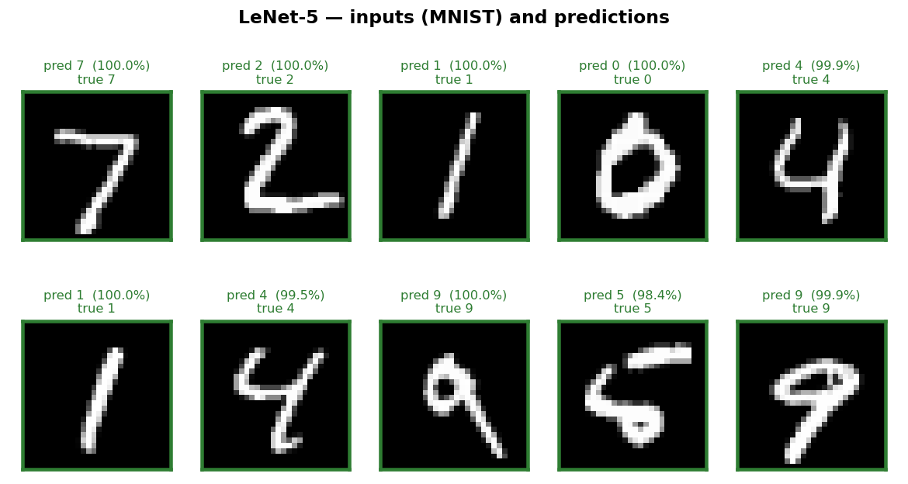
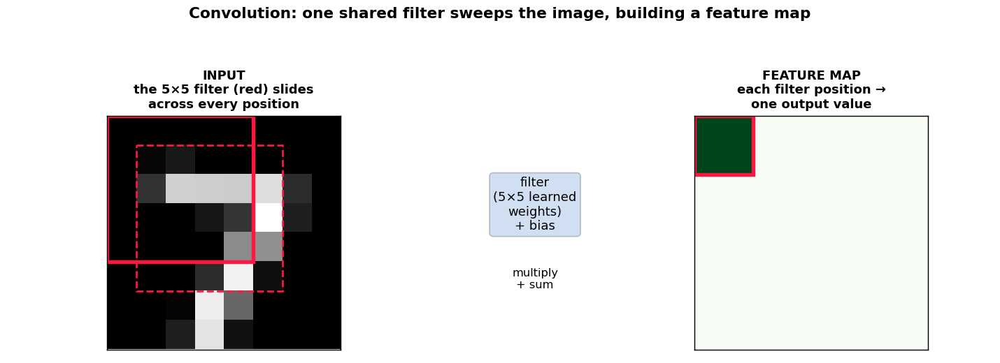
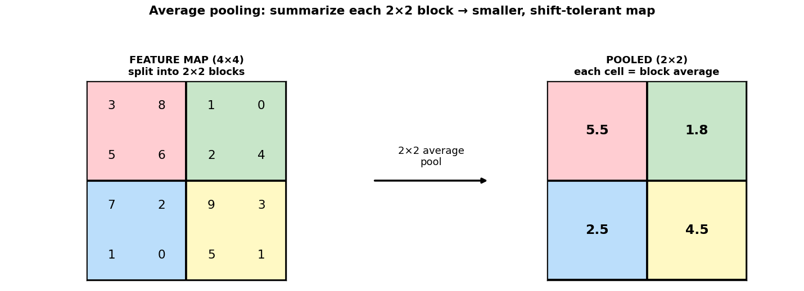
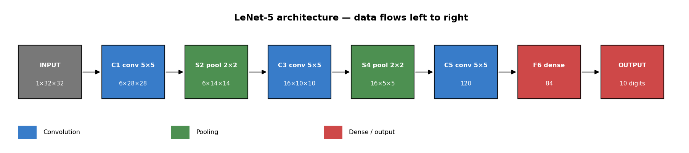
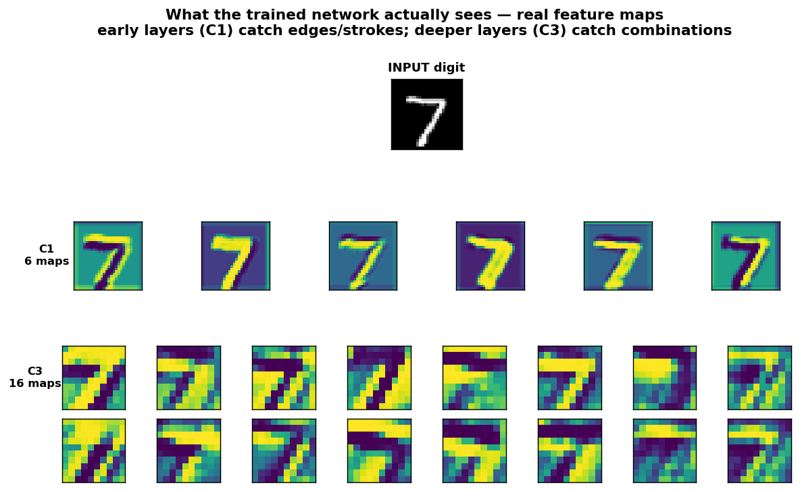
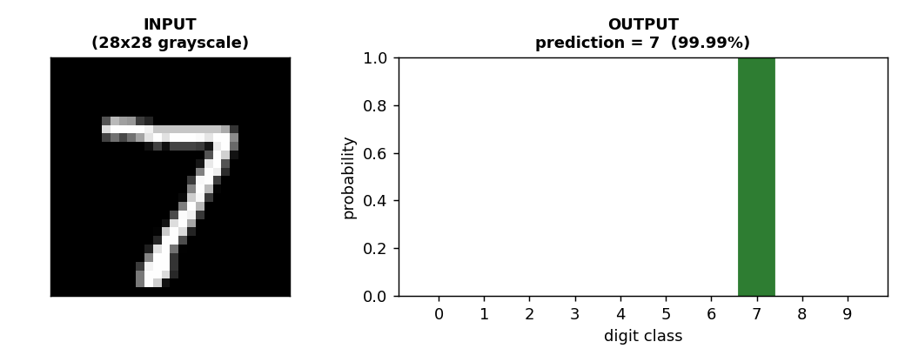

# Lesson 1 · LeNet-5 — Your First Convolutional Network

> **Stage 1 · Foundations** · Difficulty 🟢 Beginner · Dataset: MNIST · License: ✅ public (see `LICENSE-NOTES.md`)
>
> Part of [**paper2code2api**](../../../README.md) — learn computer vision by rebuilding the papers that built the field.

By the end of this lesson you will have built, trained, and served the network that *started* deep learning for images — and you'll understand every piece of it. No calculus, no linear algebra. Just basic Python and curiosity.



That grid above is your goal: a program that looks at a fuzzy 28×28 image of a handwritten digit and tells you which number it is — correctly, about 99 times out of 100. Green borders are correct predictions. By the last section, that program will be yours, running on your machine, answering HTTP requests.

### What you'll learn

- **Why** reading handwritten digits is hard for a computer, and why older approaches struggled.
- **What a neural network is** — in one honest paragraph, no mystique.
- **The three big ideas** behind every CNN ever made: convolution, feature maps, and pooling — explained with plain analogies.
- **How LeNet-5 is wired**, layer by layer, and *why* each layer is there.
- **How to turn the paper's equations into code** — the exact skill that lets you implement *any* paper, not just this one.
- **How to train it** on the MNIST dataset and reach ~98.7% test accuracy.
- **How to wrap it in an API** so you can send it your own digit images and get a prediction back.

**Prerequisites:** basic Python (functions, classes, loops). Everything else is explained as it comes up.

---

## 1. The problem: why is reading a digit hard?

You can glance at a scribbled `7` and know it's a seven instantly. A computer can't. To a computer, an image isn't a "7" — it's a grid of numbers, one per pixel, each saying how bright that spot is. A 28×28 image is just 784 brightness values.

The trouble is that *no two handwritten sevens are the same grid of numbers*. People write them tall, slanted, with or without the little crossbar, thick or thin, shifted left or right. There is no single pattern of pixels that means "7." There are thousands of them.

```
   0 0 0 0 0 0 0          0 0 0 0 0 0 0
   0 0 9 9 9 9 0          0 0 0 9 9 9 0
   0 0 0 0 0 9 0          0 0 0 0 9 9 0
   0 0 0 0 9 0 0    vs.   0 0 0 9 9 0 0
   0 0 0 9 0 0 0          0 0 9 9 0 0 0
   0 0 9 0 0 0 0          0 9 9 0 0 0 0
```
*(Two sevens. Same digit, completely different numbers.)*

For decades, the standard approach was **hand-engineered features**: a human expert would write code to measure things they *thought* mattered — number of loops, presence of a horizontal stroke at the top, the slant angle — and feed those measurements into a classifier. This was painful and brittle. You'd spend months designing features for digits, and none of that work transferred to, say, recognizing letters or faces. Every new problem meant starting the feature-engineering grind over from scratch.

The breakthrough question LeCun and colleagues asked was: **what if the machine learned the features itself, directly from the raw pixels?** That's the idea this lesson builds.

> **Paper:** LeCun, Bottou, Bengio, Haffner (1998), *Gradient-Based Learning Applied to Document Recognition*, Proceedings of the IEEE. ([PDF](http://yann.lecun.com/exdb/publis/pdf/lecun-98.pdf)) — the LeNet-5 paper. It powered real systems that read the ZIP codes on U.S. mail and the amounts on bank cheques.

---

## 2. The big idea: neural networks and convolution

### A neural network in one paragraph

A **neural network** is a stack of simple math steps with thousands of adjustable knobs (called **weights**). You feed numbers in one end (the pixels), they get multiplied and added and squashed through the layers, and numbers come out the other end (a guess at the digit). At first the knobs are random and the guesses are garbage. **Training** is the process of nudging every knob, a tiny bit at a time, so the network's guesses get less wrong — using many thousands of labeled examples. That nudging algorithm is called **backpropagation with gradient descent**; you don't need its math to use it, just the intuition: *show it examples, measure how wrong it is, adjust the knobs to be a little less wrong, repeat.*

The catch: if you connect every one of the 784 input pixels to every neuron in the next layer (a "fully-connected" or "dense" layer), you get a huge number of weights, and — worse — the network has to learn what a "7" looks like *separately for every position* it might appear in. Shift the digit two pixels to the right and it's a brand-new pattern as far as the network is concerned. That's wasteful and fragile. Convolution fixes exactly this.

### Convolution: a little stamp that slides

Here's the key analogy. Imagine a small **stamp** — say 5×5 pixels — that's good at detecting one specific little pattern, like a short diagonal edge. You slide that stamp across the whole image, one position at a time, and at each spot you ask: *"how strongly does the patch under the stamp match my pattern?"* Where it matches, you write down a high number; where it doesn't, a low one.

That sliding-and-matching operation is a **convolution**, and the stamp is called a **filter** (or **kernel**). Two things make it powerful:

- **It only looks at a small local patch at a time** (a "local receptive field"). An edge is a local thing; you don't need the whole image to spot one.
- **It uses the same stamp everywhere** ("weight sharing"). One filter that finds a diagonal edge finds it in the top-left corner *and* the bottom-right, with the same handful of weights. This is why a CNN doesn't have to relearn the digit at every position — and why it uses far fewer weights than a dense layer.

And here's the beautiful part: **we don't tell the filter what pattern to look for.** Its 25 numbers are knobs, learned during training. The network *discovers* on its own that edges and curves are useful for telling digits apart. That's the "learn the features yourself" idea, made concrete.



### Feature maps: the output of a stamp

When you slide one filter over the whole image and write down its match-score at every position, the result is a new grid of numbers called a **feature map** — literally a map of *where in the image that feature was found*. One filter → one feature map.

A convolutional layer uses *many* filters at once (LeNet's first layer uses 6), so it produces a stack of feature maps — maybe one highlighting vertical strokes, one highlighting curves, one highlighting corners. The next layer then convolves over *those* maps, combining simple features into more complex ones (a curve + a line = part of a 2). Stack a few layers and you get a **hierarchy**: edges → strokes → digit-parts → digits. That hierarchy is the whole game.

### Pooling: a deliberate blur for robustness

After a conv layer, LeNet does **subsampling**, which today we call **pooling**. It shrinks each feature map by summarizing small neighborhoods — LeNet takes each 2×2 block and replaces it with the **average** of those four numbers. So a 28×28 map becomes 14×14.

Why throw away detail on purpose? Two reasons:

1. **Robustness to small shifts.** If a feature moves by one pixel, the pooled summary barely changes. The network stops caring about *exactly* where a stroke is, only that it's roughly there — which is what you want, since people don't write in pixel-perfect positions.
2. **Efficiency.** Smaller maps mean less computation for the layers that follow.



One more squash to mention: between these steps each value is passed through an **activation function** that bends it into a gentle S-curve. LeNet uses **tanh** (the hyperbolic tangent), which maps any number to a value between −1 and +1. The point is to add a little non-linearity so the network can model curvy, complicated relationships instead of just straight-line ones. (Modern networks usually use a simpler function called ReLU — you'll get to try swapping it in the exercises.)

That's it. **Convolution finds local patterns with shared filters, pooling adds tolerance to position, and stacking them builds a hierarchy of features — all learned from data.** Everything below is just these three ideas, arranged in a specific order.

---

## 3. LeNet-5, layer by layer

Here's the full architecture. The names (C1, S2, …) are LeCun's own from the paper. "C" layers are **C**onvolutions, "S" layers are **S**ubsampling (pooling), "F" is **F**ully-connected.

```
input 1×32×32
 └ C1  conv 5×5, 6 filters   -> 6×28×28    + tanh
 └ S2  avgpool 2×2           -> 6×14×14
 └ C3  conv 5×5, 16 filters  -> 16×10×10   + tanh
 └ S4  avgpool 2×2           -> 16×5×5
 └ C5  conv 5×5, 120 filters -> 120×1×1    + tanh
 └ F6  fully-connected 120 -> 84           + tanh
 └ out fully-connected 84 -> 10            (one score per digit 0–9)
```



Read the shapes as `channels × height × width`. Let's walk through it.

**Input — 1×32×32.** MNIST images are 28×28 grayscale (1 channel, since there's no color). But the paper pads them to **32×32** by adding a 2-pixel border of black all around. Why? So that the 5×5 filters can fully cover the corners and edges of the original digit without running off the side. The `1` is the single grayscale channel.

**C1 — six 5×5 filters → 6×28×28.** Six different stamps slide over the 32×32 input, each producing one 28×28 feature map. (A 5×5 stamp can sit in 28 distinct positions across a 32-wide image, hence 28×28.) These six filters learn to detect six kinds of low-level pattern — edges and simple strokes.

**S2 — 2×2 average pool → 6×14×14.** Halve each map's height and width by averaging 2×2 blocks. Six maps in, six maps out, each now 14×14. More position-tolerant, cheaper.

**C3 — sixteen 5×5 filters → 16×10×10.** A second conv layer, now combining the six incoming maps into sixteen richer feature maps. These detect combinations of the C1 features — corners, junctions, bits of curve.

**S4 — 2×2 average pool → 16×5×5.** Pool again. Sixteen maps, now 5×5 each.

**C5 — one hundred twenty 5×5 filters → 120×1×1.** The input here is 5×5 and the filter is 5×5, so each filter sees the *entire* map at once and collapses it to a single number. The result is 120 numbers — think of them as 120 high-level summaries of the whole image. At this point we've gone from raw pixels to an abstract description.

**F6 — fully-connected, 120 → 84.** A classic dense layer: every one of the 120 values connects to every one of 84 neurons. This mixes the high-level features together.

**Output — fully-connected, 84 → 10.** Ten neurons, one per digit class (0 through 9). The neuron with the highest score is the network's guess. Later we'll run these ten scores through a **softmax** to turn them into probabilities that sum to 1.

All of this lives in `model.py`, and it maps one-to-one onto the diagram. Here it is:

```python
class LeNet5(nn.Module):
    """Classic LeNet-5 for 32x32 grayscale input, 10-class output."""

    def __init__(self, num_classes: int = 10):
        super().__init__()
        self.features = nn.Sequential(
            nn.Conv2d(1, 6, kernel_size=5),         # C1: 1x32x32 -> 6x28x28
            nn.Tanh(),
            nn.AvgPool2d(kernel_size=2, stride=2),  # S2: -> 6x14x14
            nn.Conv2d(6, 16, kernel_size=5),        # C3: -> 16x10x10
            nn.Tanh(),
            nn.AvgPool2d(kernel_size=2, stride=2),  # S4: -> 16x5x5
            nn.Conv2d(16, 120, kernel_size=5),      # C5: -> 120x1x1
            nn.Tanh(),
        )
        self.classifier = nn.Sequential(
            nn.Flatten(),
            nn.Linear(120, 84),                     # F6
            nn.Tanh(),
            nn.Linear(84, num_classes),             # output
        )

    def forward(self, x):
        x = self.features(x)
        return self.classifier(x)
```

Read it top-to-bottom against the diagram and it's almost a transcript. `nn.Conv2d(1, 6, 5)` is "take 1 input channel, produce 6 feature maps, with 5×5 filters" — that's C1. `nn.AvgPool2d(2, 2)` is the 2×2 average pooling — that's S2. `nn.Flatten()` turns the `120×1×1` block into a flat list of 120 numbers so the dense `nn.Linear` layers can consume it. `forward` just says: run the input through the feature extractor, then through the classifier.

The whole network has **61,706 trainable weights** — tiny by today's standards (modern networks have millions to billions), which is exactly why it trains in a couple of minutes on a plain laptop CPU. You can verify the count yourself:

```bash
python model.py
# output shape: (1, 10)  |  parameters: 61,706
```

> **Tip:** The `if __name__ == "__main__"` block at the bottom of `model.py` runs a "sanity check" — it pushes a random 1×32×32 tensor through the network just to confirm the shapes line up end to end and prints the parameter count. Running a file directly to test it is a handy habit.

And here's the real payoff. Run `python make_figures.py` and you can *see* what those layers actually learned. Below, a real **7** flows through the trained network: the six **C1** maps light up along the digit's edges and strokes, while the sixteen deeper **C3** maps respond to more abstract combinations of those features. This is the "hierarchy of features" from Section 2 — no longer an analogy, but the actual output of your model.



---

## 4. From the paper's equations to code

This is the part most tutorials skip — and it's the exact wall people hit when they try to implement a paper themselves. A paper states an operation as a formula full of Greek letters and subscripts; your job is to recognize *which line of code is that formula*. Below we take the core LeNet-5 equations straight from the 1998 paper and show the PyTorch that implements each one. Do this enough times and a paper's math stops being scary — you start seeing the code hiding inside it.

> **How to read this:** for each operation we show the paper's equation, translate every symbol into plain words, then show the code. The recurring punchline — *a page of math becomes a handful of well-named PyTorch calls.*

### 4.1 Convolution — the heart of it

A convolutional feature map takes every local 5×5 patch of the input, multiplies it by a shared filter, sums, adds a bias. The value of feature map $j$ at position $(x, y)$ is:

$$
a_j(x, y) \;=\; b_j \;+\; \sum_{c}\;\sum_{u=0}^{4}\;\sum_{v=0}^{4} \; w_{j,c}(u, v)\,\cdot\, z_c\big(x+u,\; y+v\big)
$$

Symbol by symbol:

- $z_c$ — the input, channel $c$ (C1 has one channel: the grayscale image).
- $w_{j,c}(u,v)$ — the **filter**: a 5×5 grid of learnable weights ($u,v$ run 0–4). One filter per output map $j$, and crucially it's the *same* filter at every position $(x,y)$ — that's **weight sharing**.
- $b_j$ — one learnable bias per output map.
- The triple sum just says "line the 5×5 filter up over the patch, multiply element-wise, add it all up" — repeated for every input channel $c$.

In code, that whole equation — the sliding, the multiply-add over all channels, the per-map bias, the weight sharing — is **one line**:

```python
nn.Conv2d(in_channels=1, out_channels=6, kernel_size=5)   # C1
```

You never write the loops. `nn.Conv2d` *is* the equation: `out_channels=6` means "six filters → six feature maps $j$," `kernel_size=5` is the 5×5 grid of weights $w$, and the bias $b_j$ is included by default. This single translation underlies almost every computer-vision paper ever written — learn to see it and you've learned to read half the field.

### 4.2 The output-size formula — your shape detective

The question that stalls every from-scratch attempt: *"why does 32×32 turn into 28×28?"* There's an equation for that, and you'll reach for it constantly to make layers fit together:

$$
O \;=\; \left\lfloor \frac{W - F + 2P}{S} \right\rfloor + 1
$$

where $W$ = input size, $F$ = filter size, $P$ = padding, $S$ = stride. For C1: $W=32,\,F=5,\,P=0,\,S=1$ → $O = (32-5)/1 + 1 = 28$. That's where the **28** in 6×28×28 comes from. Pooling uses the same formula with $F=S=2$. Trace it down and the entire shape column of the diagram falls right out:

| Layer | $W$ | $F$ | $P$ | $S$ | → $O$ |
|---|---|---|---|---|---|
| C1 | 32 | 5 | 0 | 1 | **28** |
| S2 | 28 | 2 | 0 | 2 | **14** |
| C3 | 14 | 5 | 0 | 1 | **10** |
| S4 | 10 | 2 | 0 | 2 | **5** |
| C5 | 5 | 5 | 0 | 1 | **1** |

> **This is the #1 debugging tool** when your own model throws a shape-mismatch error. Compute $O$ by hand for each layer and you'll find exactly where the sizes stop lining up.

### 4.3 The activation function — paper vs. practice

A perfect example of the gap between paper and code. The paper doesn't use plain tanh — it uses a **scaled** tanh (Appendix A), tuned so the function maps the range [−1, 1] roughly onto itself for faster convergence:

$$
f(x) \;=\; 1.7159\,\tanh\!\left(\tfrac{2}{3}\,x\right)
$$

Our code uses the *plain* version:

```python
nn.Tanh()        # f(x) = tanh(x)
```

**Why the difference?** Those magic constants were a 1998 optimization trick that modern training (better weight initialization, the Adam optimizer, mini-batching) makes unnecessary — plain tanh trains fine here. This is exactly the kind of paper-vs-code gap you should *notice and understand* rather than be tripped up by. If you wanted to be 100% faithful, it's a few lines:

```python
class ScaledTanh(nn.Module):
    def forward(self, x):
        return 1.7159 * torch.tanh((2 / 3) * x)
```

Dropping that in for `nn.Tanh()` is a great exercise in turning an equation directly into a layer.

### 4.4 Subsampling — the paper's pooling vs. ours

The original S2/S4 layers are *not* plain average pooling. The paper's subsampling cell sums its four inputs, scales them by a **trainable** coefficient $w$, adds a **trainable** bias $b$, then squashes:

$$
s(x,y) \;=\; f\!\Big(w \cdot \!\!\sum_{i=1}^{4} x_i \;+\; b\Big)
$$

That's average pooling *with two learnable knobs and a nonlinearity bolted on*. Our code uses ordinary average pooling — no trainable $w$/$b$, no activation:

```python
nn.AvgPool2d(kernel_size=2, stride=2)   # s(x,y) = mean of each 2x2 block
```

Plain averaging is just the paper's formula with $w = \tfrac14$ (turning the sum into a mean), $b = 0$, and $f$ = identity. Modern networks dropped the trainable version because it adds parameters for little gain — another concrete case of "the paper did X; today we simplify to Y," now visible right in the math.

### 4.5 The output — RBF (then) vs. softmax + cross-entropy (now)

The paper's final layer computed, for each class $i$, the squared Euclidean distance between the 84 features $x_j$ and a learned prototype vector $w_{ij}$:

$$
y_i \;=\; \sum_{j} \big(x_j - w_{ij}\big)^2
$$

A *smaller* $y_i$ meant "closer to the ideal digit $i$." Clever for 1998, but unusual today. We use the universal modern classifier recipe instead. First a plain linear layer produces 10 raw scores (**logits**):

```python
nn.Linear(84, 10)     # 10 raw scores, one per digit
```

Then **softmax** turns those scores into probabilities that sum to 1:

$$
p_i \;=\; \frac{e^{z_i}}{\sum_{k=0}^{9} e^{z_k}}
$$

```python
probs = torch.softmax(logits, dim=1)      # used in infer.py
```

And training minimizes **cross-entropy** loss — for the correct label $t$, it's simply:

$$
\mathcal{L} \;=\; -\log p_t
$$

i.e. "the loss is small only when the probability assigned to the *right* digit is large." PyTorch fuses the softmax and the log into one numerically-stable call:

```python
criterion = nn.CrossEntropyLoss()         # used in train.py
loss = criterion(model(images), labels)   # = -log(p_correct), averaged over the batch
```

That one object is the entire training objective. Notice the pattern across this whole section: **a page of paper math collapses into a handful of well-named PyTorch calls.** Learning to *see* that mapping — not memorizing the library — is the skill that lets you implement any paper you read.

---

## 5. Faithful vs. modernized — what we changed and why

Our code is a **faithful-but-modernized** reproduction. We kept the period-authentic choices that define LeNet's character — **tanh** activations, **average** pooling, and the **32×32** padded input — but we made two deliberate simplifications so the code stays beginner-readable. It's worth knowing exactly what differs from the 1998 paper, so you're never confused comparing our code to the original.

1. **C3 connections.** In the paper, C3 did *not* connect every S2 map to every C3 filter. LeCun used a hand-designed **sparse connection table** — each C3 filter looked at only a chosen subset of the six S2 maps — to save computation and to force different filters to learn different things. We use **full connections** (every C3 filter sees all six S2 maps). At this scale the extra cost is negligible, and it removes a confusing lookup table from the code.

2. **Output layer.** The paper's final layer used **Gaussian "RBF" units** with a specialized loss function — clever for 1998, but unusual and fiddly today. We use a standard **linear layer + softmax cross-entropy**, the universal modern recipe for classification. (Cross-entropy is just a loss that says "be confident *and* correct"; softmax turns raw scores into probabilities.)

Neither change alters the core lesson of the paper — convolution, pooling, and learned hierarchical features. They just keep the code clean. Whenever a lesson in this course simplifies a paper, you'll find a section exactly like this one telling you what and why.

---

## 6. Build it yourself

You'll work through three files in order: `model.py` (done — that was Section 3), then `train.py` to teach the network, then `infer.py` to make predictions.

**Setup.** From inside the `lenet5` folder:

```bash
pip install -r requirements.txt
```

### Training — `train.py`

Training has a fixed shape that you'll see in every lesson: load data, set up the model, then loop over the data many times nudging the weights. Let's read the important parts.

First, the data and how it's prepared:

```python
TRANSFORM = transforms.Compose([
    transforms.ToTensor(),                           # PIL image -> tensor, pixels scaled to [0,1]
    transforms.Normalize((0.1307,), (0.3081,)),      # center the pixel values (MNIST's known mean/std)
    transforms.Pad(2),                               # 28x28 -> 32x32, the LeNet input size
])
```

This is the **preprocessing pipeline** every image passes through. `ToTensor` converts the image into the array format PyTorch works with. `Normalize` shifts the pixel values so they're centered around zero using MNIST's well-known average (0.1307) and spread (0.3081) — this makes training faster and steadier. `Pad(2)` adds the 2-pixel border to reach 32×32. **The exact same pipeline must be used at prediction time** — get this even slightly wrong on your own images and the network's accuracy collapses. (More on that gotcha in Section 8.)

Now the training loop itself, lightly trimmed:

```python
train_ds = datasets.MNIST(HERE / "data", train=True,  download=True, transform=TRANSFORM)
test_ds  = datasets.MNIST(HERE / "data", train=False, download=True, transform=TRANSFORM)
train_dl = DataLoader(train_ds, batch_size=64, shuffle=True)

model = LeNet5().to(device)
optimizer = torch.optim.Adam(model.parameters(), lr=1e-3)
criterion = nn.CrossEntropyLoss()

for epoch in range(1, epochs + 1):
    model.train()
    for images, labels in train_dl:
        optimizer.zero_grad()              # clear last step's gradients
        loss = criterion(model(images), labels)   # how wrong are we?
        loss.backward()                    # compute which way to nudge each weight
        optimizer.step()                   # take the nudge
    acc = evaluate(model, test_dl, device) # how well do we do on unseen digits?
    print(f"epoch {epoch}/{epochs}  test_acc={acc:.4f}")
```

The first run **downloads MNIST** (60,000 training images, 10,000 test images — all free) into a local `data/` folder. Then the magic, line by line:

- **`model(images)`** runs a batch of 64 images forward and produces ten scores each.
- **`criterion(...)`** is the loss — one number measuring total wrongness on this batch.
- **`loss.backward()`** is backpropagation: it figures out, for every one of the 61,706 weights, which direction would reduce the loss.
- **`optimizer.step()`** nudges all the weights that way. We use **Adam**, a popular optimizer that adapts the step size automatically.
- **`optimizer.zero_grad()`** clears the previous batch's bookkeeping so nudges don't accumulate across batches. (Forgetting this is a classic beginner bug — the loop silently misbehaves.)

One full pass over all 60,000 training images is one **epoch**. We do several. Crucially, we measure accuracy on the **test set** — 10,000 images the network never trained on — because the only accuracy that matters is on data it hasn't seen.

Run it:

```bash
python train.py --epochs 5
```

Expected output (numbers will vary slightly run-to-run):

```
device: cpu
epoch 1/5  train_loss=0.2439  test_acc=0.9713
epoch 2/5  train_loss=0.0697  test_acc=0.9818
epoch 3/5  train_loss=0.0466  test_acc=0.9869
epoch 4/5  train_loss=0.0371  test_acc=0.9861
epoch 5/5  train_loss=0.0299  test_acc=0.9817
saved weights -> .../lenet5.pt
```

*(This is a real run on CPU — your numbers will differ slightly.)* Watch the **training loss fall steadily** every epoch — that's learning happening in front of you. **Test accuracy** shoots up to ~97% in the first epoch, then hovers around **98–99%**, wobbling a little from epoch to epoch (in this run it actually peaked at epoch 3, then dipped slightly). That small wobble is normal and worth understanding: once the model is already good, *which* of the 10,000 unseen digits it gets right shifts a bit each epoch. It's a first hint of a big idea you'll meet later — training longer doesn't always mean a better model. The whole run takes roughly two minutes on a CPU. The trained weights are saved to `lenet5.pt`; that file *is* your model — 61,706 learned numbers.

> **Note:** Don't expect a perfect 100%. Some MNIST digits are genuinely ambiguous even to humans (a hastily-written 4 can look like a 9). Getting ~99% on this dataset has been a solved problem since 1998 — the achievement here is *how* it's solved, with zero hand-engineered features.

### Inference — `infer.py`

Training is over; now we *use* the model. `infer.py` loads the saved weights and turns an image into a prediction.

```python
@lru_cache(maxsize=1)
def load_model() -> LeNet5:
    if not WEIGHTS_PATH.exists():
        raise FileNotFoundError("weights not found. Run `python train.py` first.")
    model = LeNet5()
    model.load_state_dict(torch.load(WEIGHTS_PATH, map_location="cpu"))
    model.eval()
    return model
```

`load_state_dict` pours the saved numbers back into a fresh `LeNet5`. `model.eval()` switches the network into evaluation mode (it behaves slightly differently during training vs. prediction). The `@lru_cache` decorator means the weights load from disk only **once**, no matter how many predictions you make — important for the API, which shouldn't re-read the file on every request.

The prediction function:

```python
@torch.no_grad()
def predict(img: Image.Image, invert: bool = False) -> dict:
    model = load_model()
    logits = model(preprocess(img, invert=invert))
    probs = torch.softmax(logits, dim=1).squeeze(0)
    pred = int(probs.argmax().item())
    return {
        "prediction": pred,
        "confidence": float(probs[pred].item()),
        "probabilities": [round(float(p), 6) for p in probs.tolist()],
    }
```

Three steps: preprocess the image exactly as in training, run it through the model to get ten raw scores (`logits`), then `softmax` to turn those scores into ten **probabilities** that sum to 1. `argmax` picks the index of the largest probability — that's the predicted digit — and `confidence` is how sure the model is. `@torch.no_grad()` tells PyTorch to skip the training-only bookkeeping, making prediction faster.

Try it on a single image from the command line:

```bash
python infer.py some_digit.png             # MNIST-style: white digit on black
python infer.py photo_of_digit.png --invert  # your own drawing: black digit on white
```

That `--invert` flag is important, and Section 8 explains exactly why.

---

## 7. From model to API — `api.py`

A trained model sitting in a `.pt` file isn't useful to anyone else. The final step of every lesson is to wrap it in a web API so any program (or person, via `curl`) can send it an image and get a prediction. We use **FastAPI**, a popular, beginner-friendly Python web framework.

Every model in paper2code2api speaks the **same contract**, so they're interchangeable:

```
POST /predict   (multipart image file)  -> JSON { prediction, confidence, probabilities }
GET  /health                            -> { status, model_loaded }
```

Here's the heart of `api.py`:

```python
@app.post("/predict")
async def predict_endpoint(
    file: UploadFile = File(..., description="Image of a single digit"),
    invert: bool = Query(False, description="Set true for black-on-white input"),
) -> dict:
    raw = await file.read()
    try:
        img = Image.open(io.BytesIO(raw))
    except UnidentifiedImageError:
        raise HTTPException(status_code=400, detail="Uploaded file is not a valid image.")
    try:
        return predict(img, invert=invert)
    except FileNotFoundError as exc:
        raise HTTPException(status_code=503, detail=str(exc))  # model not trained yet
```

Notice this endpoint does barely any new work — it reads the uploaded bytes, opens them as an image, and hands off to the same `predict()` function you already met in `infer.py`. That's the payoff of keeping inference logic in its own file: the API is just a thin wrapper. It also handles the two obvious failure modes gracefully — a non-image upload (HTTP 400) and a model that hasn't been trained yet (HTTP 503). There's also a tiny `startup` hook that loads the weights eagerly so the very first request isn't slow.

Start the server:

```bash
uvicorn api:app --reload
```

Then open **http://127.0.0.1:8000/docs** in your browser — FastAPI auto-generates an interactive page where you can upload an image and see the response, no code required. Or send a request from the terminal:

```bash
curl -F "file=@some_digit.png" "http://127.0.0.1:8000/predict?invert=false"
```

You'll get back something like:

```jsonc
{
  "prediction": 7,
  "confidence": 0.9991,
  "probabilities": [/* 10 floats, index = digit class 0–9 */]
}
```

This is exactly the input→output relationship, visualized — one input digit on the left, the ten output probabilities on the right (the tall green bar is the winner):



*(Regenerate these figures any time with `python make_examples.py`.)*

---

## 8. The #1 gotcha: white-on-black vs. black-on-white

Here's the mistake that trips up everyone the first time they feed the model their *own* digit. You'd expect: *I trained a 99%-accurate digit reader, so my hand-drawn `3` should be easy.* Instead it confidently predicts garbage. Why?

**MNIST digits are white strokes on a black background.** Your phone photo or paint drawing is almost certainly the opposite — a black digit on white paper. To the network, "white where I expect black" is an alien image it never saw in training, so its guess is meaningless.

The fix is the `invert` flag, which flips the colors back to MNIST's convention before preprocessing:

```python
if invert:
    img = ImageOps.invert(img.convert("L"))   # .convert("L") = grayscale
```

So the rule is simple:

- MNIST-style image (white-on-black) → `invert=false` (the default).
- Your own drawing/photo (black-on-white) → **`invert=true`** (CLI: `--invert`).

> **⚠️ Common mistake:** If your custom-image predictions are confidently wrong, this is almost always the cause — *the classifier is only as good as the preprocessing match*. Before blaming the model, check that your image reaches it in the same form the training images did: grayscale, single digit, roughly centered, and the right color polarity.

---

## 9. Exercises — try it yourself

Work these in order; each builds a little more intuition. (Suggested solutions are an exercise in reading the code you already have.)

1. **Train longer (easy).** Run `python train.py --epochs 10`. Does test accuracy keep climbing, plateau, or wobble? Compare the final number to your 5-epoch run. *Lesson: more training has diminishing returns — and eventually risks overfitting.*

2. **Classify your own handwriting (easy).** Draw a single digit in any paint program on a **white** background with a thick black brush, save it as a PNG, and run `python infer.py my_digit.png --invert`. Did it get it right? Try a messy one. *Lesson: real-world inputs need the preprocessing to match — revisit Section 8 if it fails.*

3. **Call your API (medium).** Start the server (`uvicorn api:app --reload`), open `http://127.0.0.1:8000/docs`, and upload the digit you drew. Then do the same with `curl`. Look at the full `probabilities` array — which *other* digit was the model's second guess? *Lesson: the model expresses uncertainty, not just a single answer.*

4. **Swap tanh for ReLU (medium).** In `model.py`, replace every `nn.Tanh()` with `nn.ReLU()` and retrain. Does it train faster, slower, or to a different accuracy? *Lesson: ReLU is the modern default activation — this is one concrete step from the 1998 design toward today's networks.*

5. **Add a `/classes` endpoint (harder).** Add a `GET /classes` route to `api.py` that returns the list of digit labels this model can predict, e.g. `{"classes": [0,1,2,...,9]}`. *Lesson: extending the API contract — exactly what you'll do for richer models in later lessons.*

> **⚠️ Common mistake:** After editing `model.py` (exercise 4), you **must retrain** — the old `lenet5.pt` weights belong to the old architecture and won't load into the new one (or will load but predict nonsense). Delete `lenet5.pt`, rerun `python train.py`, then test.

---

## 10. Recap & what's next

You just built a real convolutional neural network from the ground up. Here's what you now understand:

- **Why hand-engineered features lost** — and why *learning* features from raw pixels was the breakthrough.
- **Convolution** — a small learned filter slides over the image and reports where its pattern appears, sharing weights across every position.
- **Feature maps & hierarchy** — stacking conv layers turns edges into strokes into digit-parts into digits.
- **Pooling** — averaging small neighborhoods buys robustness to small shifts and shrinks the computation.
- **LeNet-5's wiring** — C1→S2→C3→S4→C5→F6→output, ~61.7k weights, and how it maps line-for-line onto `model.py`.
- **The full pipeline** — preprocess → train (~98.7% on MNIST) → infer → serve a `POST /predict` API — and the white-on-black gotcha that ruins custom images.

Every CNN that followed — AlexNet, VGG, ResNet, the networks in your phone's camera — is a descendant of these exact ideas, made deeper and trained on bigger data. You've seen the blueprint.

**Next: [Lesson 2 · AlexNet (2012)](../alexnet)** *(coming soon)* — the network that, fourteen years later, took these same ideas, scaled them up with ReLU and GPUs, trained on millions of real color photos, and kicked off the deep-learning explosion.

← Back to the [**course home**](../../../README.md)

---

### Files in this lesson

| File | Purpose |
|---|---|
| `README.md` | This lesson |
| `model.py` | LeNet-5 architecture — the reference implementation |
| `train.py` | Train on MNIST, save `lenet5.pt` |
| `infer.py` | Preprocess + predict; usable standalone or as a library |
| `api.py` | FastAPI server exposing the shared `POST /predict` contract |
| `make_examples.py` | Generates the input/output example figures |
| `make_figures.py` | Generates the teaching diagrams (architecture, convolution, pooling, feature maps) |
| `requirements.txt` | Dependencies |
| `LICENSE-NOTES.md` | License status (✅ safe to ship) |
